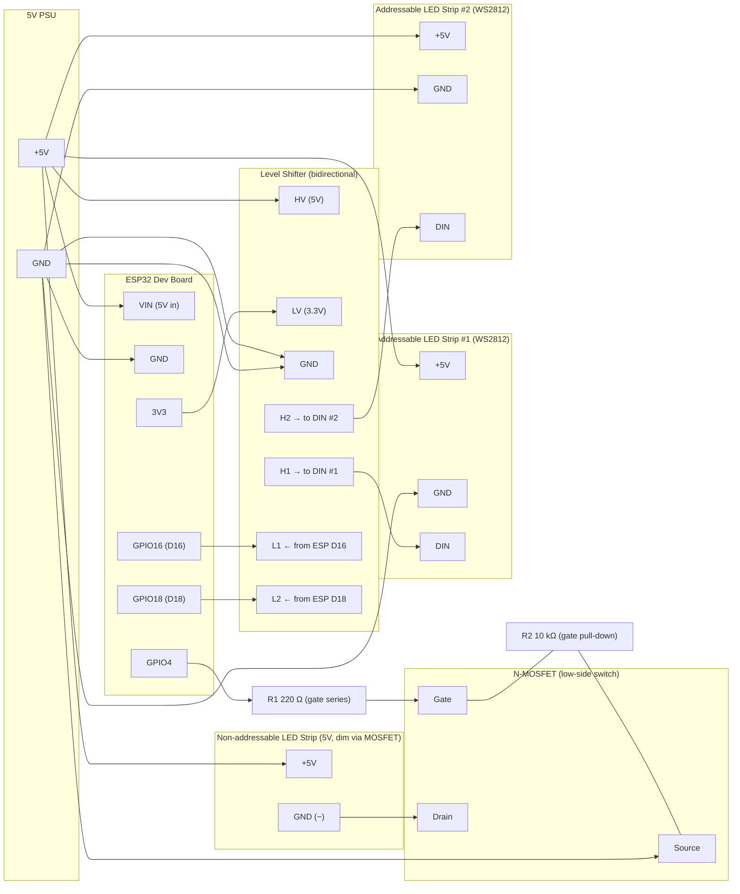

```mermaid
graph LR
  %% Layout
  %% Use subgraphs to mimic modules/parts
  subgraph PSU["5V PSU"]
    P5V["+5V"]
    PGND["GND"]
  end

  subgraph ESP["ESP32 Dev Board"]
    VIN["VIN (5V in)"]
    GND_E["GND"]
    V3V3["3V3"]
    GPIO4["GPIO4"]
    D16["GPIO16 (D16)"]
    D18["GPIO18 (D18)"]
  end

  subgraph MOSFET["N-MOSFET (low-side switch)"]
    Gate["Gate"]
    Drain["Drain"]
    Source["Source"]
  end

  R1["R1 220 Ω (gate series)"]
  R2["R2 10 kΩ (gate pull-down)"]

  subgraph LS["Level Shifter (bidirectional)"]
    HV["HV (5V)"]
    LV["LV (3.3V)"]
    GND_LS["GND"]
    H1["H1 → to DIN #1"]
    H2["H2 → to DIN #2"]
    L1["L1 ← from ESP D16"]
    L2["L2 ← from ESP D18"]
  end

  %% Non-addressable 5V LED strip driven by MOSFET
  subgraph DUMB["Non-addressable LED Strip (5V, dim via MOSFET)"]
    DUMB_PLUS["+5V"]
    DUMB_MINUS["GND (−)"]
  end

  %% Addressable strips (e.g., WS2812/NEOPIXEL)
  subgraph S1["Addressable LED Strip #1 (WS2812)"]
    S1_5V["+5V"]
    S1_GND["GND"]
    S1_DIN["DIN"]
  end

  subgraph S2["Addressable LED Strip #2 (WS2812)"]
    S2_5V["+5V"]
    S2_GND["GND"]
    S2_DIN["DIN"]
  end

  %% Power connections
  P5V --> VIN
  P5V --> DUMB_PLUS
  P5V --> S1_5V
  P5V --> S2_5V

  %% Common grounds
  PGND --> Source
  PGND --> GND_E
  PGND --> GND_LS
  PGND --> S1_GND
  PGND --> S2_GND

  %% MOSFET wiring for non-addressable strip
  DUMB_MINUS --> Drain
  GPIO4 --> R1 --> Gate
  Gate --- R2 --- Source

  %% Level shifter power & reference
  P5V --> HV
  V3V3 --> LV
  PGND --> GND_LS

  %% Data paths (3.3V -> 5V)
  D16 --> L1
  D18 --> L2
  H1 --> S1_DIN
  H2 --> S2_DIN
```