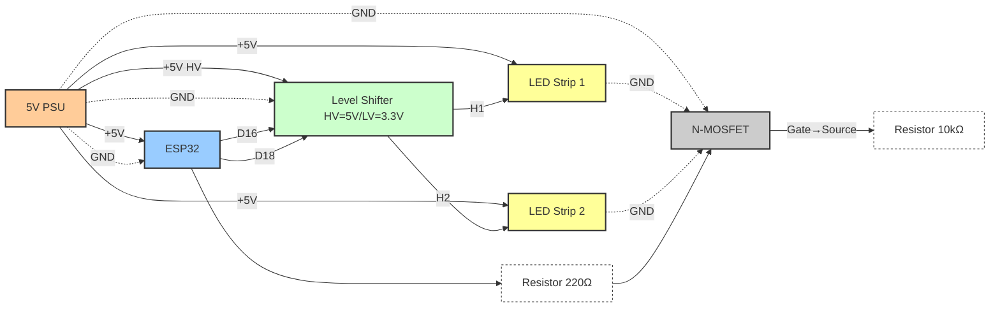

```mermaid
flowchart LR
    PSU[5V PSU]:::psu
    ESP[ESP32]:::esp
    MOSFET[N-MOSFET]:::mosfet
    R220[Resistor 220Ω]:::res
    R10k[Resistor 10kΩ]:::res
    LS[Level Shifter HV=5V/LV=3.3V]:::ls
    LED1[LED Strip 1]:::led
    LED2[LED Strip 2]:::led

    %% Power
    PSU -->|+5V| ESP
    PSU -->|+5V| LED1
    PSU -->|+5V| LED2
    PSU -->|+5V HV| LS

    %% Grounds
    PSU -.->|GND| ESP
    PSU -.->|GND| MOSFET
    PSU -.->|GND| LS

    %% LED strip grounds through MOSFET
    LED1 -.->|GND| MOSFET
    LED2 -.->|GND| MOSFET

    %% Data lines
    ESP -->|D16| LS
    ESP -->|D18| LS
    LS -->|H1| LED1
    LS -->|H2| LED2

    %% Gate resistors
    ESP --> R220 --> MOSFET
    MOSFET -->|Gate→Source| R10k

    classDef psu fill:#ffcc99,stroke:#333,stroke-width:2px;
    classDef esp fill:#99ccff,stroke:#333,stroke-width:2px;
    classDef mosfet fill:#cccccc,stroke:#333,stroke-width:2px;
    classDef ls fill:#ccffcc,stroke:#333,stroke-width:2px;
    classDef led fill:#ffff99,stroke:#333,stroke-width:2px;
    classDef res fill:#ffffff,stroke:#333,stroke-dasharray: 3 3;
```