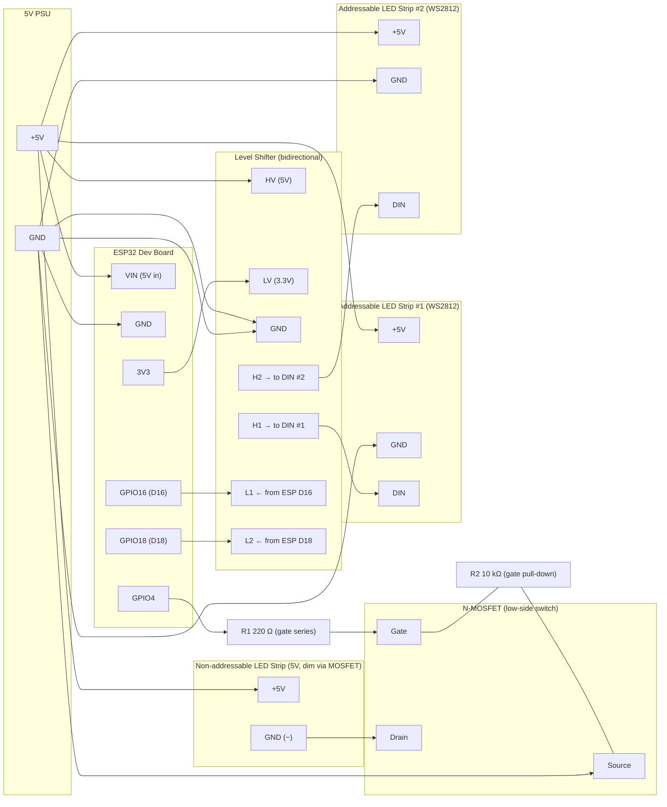

## HTTP API Endpoints

This device exposes a simple HTTP API served from the built-in web server. All endpoints use HTTP GET and return JSON responses (or HTML for the root). Use your browser or curl to interact with them.

Base URL: http://<device-hostname-or-ip>/

List of endpoints:

- `GET /` — Returns the web UI (HTML page) with controls for the strips and animations.

- Regular (non-addressable) dim strip (PWM, MOSFET on GPIO 4):
  - `GET /api/dim/on` — Turn PWM strip on (uses stored brightness).
    - Response: {"ok":true}
  - `GET /api/dim/off` — Turn PWM strip off (PWM duty = 0).
    - Response: {"ok":true}
  - `GET /api/dim/brightness?b=<0-255>` — Set stored brightness and apply when strip is on.
    - Query: `b` (0..255)
    - Response: {"ok":true,"brightness":<value>}

- Addressable strip #1 (WS2812 on GPIO 17):
  - `GET /api/ws1/on` — Turn strip on (uses stored color & brightness).
  - `GET /api/ws1/off` — Turn strip off (clears pixels).
  - `GET /api/ws1/set?b=<0-255>&r=<0-255>&g=<0-255>&b2=<0-255>` — Set brightness and RGB color.
    - Note: query parameter for blue is named `b2` to avoid collision with brightness `b`.
    - Response: {"ok":true}

- Addressable strip #2 (WS2812 on GPIO 18):
  - `GET /api/ws2/on` — Turn strip on.
  - `GET /api/ws2/off` — Turn strip off.
  - `GET /api/ws2/set?b=<0-255>&r=<0-255>&g=<0-255>&b2=<0-255>` — Set brightness and RGB color for strip #2.
    - Response: {"ok":true}

- Global convenience:
  - `GET /api/onall` — Turn PWM strip and both addressable strips on (apply stored values).
  - `GET /api/offall` — Turn everything off.

- Animations:
  - `GET /api/anim/start?name=<sunrise|sunset|waves>&dur=<ms>` — Start an animation.
    - `name` (required): one of `sunrise`, `sunset`, or `waves`.
    - `dur` (optional): duration in milliseconds. If omitted for `sunrise`/`sunset`, the server defaults to 20 minutes (1,200,000 ms). If omitted for `waves`, a short default (30s) is used.
    - Response: {"ok":true}
    - Examples:
      - `GET /api/anim/start?name=sunrise` — Start sunrise for default 20 minutes.
      - `GET /api/anim/start?name=sunset&dur=600000` — Start 10-minute sunset.
  - `GET /api/anim/stop` — Stop any running animation and return to manual controls.

Notes and tips:
- Use the root web UI for quick interactive control from a browser.
- Blue channel query parameter is named `b2` to avoid conflict with brightness `b` in the same query string.
- Animations are non-blocking and progress is handled in the main loop; calling `anim/stop` will immediately stop them.

